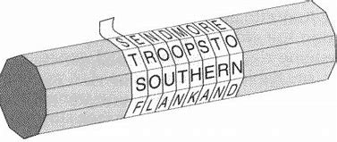
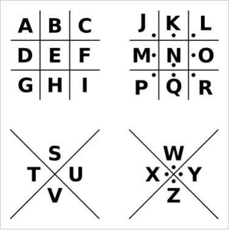
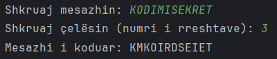
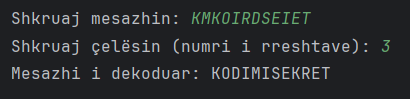
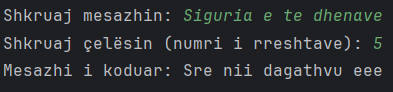
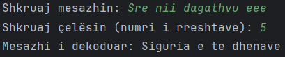
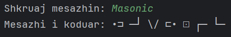
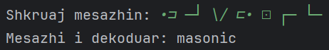
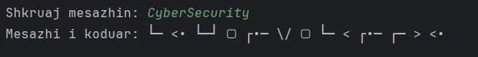

# 🔐 Java Message Cipher App – Scytale & Pigpen

Ky aplikacion Java lejon përdoruesin të enkriptojë dhe dekriptojë mesazhe duke përdorur dy algoritme klasike të kriptografisë:

- **Scytale Transposition Cipher**
- **Pigpen Cipher**

---

## 🧰 Kërkesat për ekzekutim

- Java 8 ose më i ri
- IDE (p.sh. IntelliJ IDEA, Eclipse) ose terminal
- `Main.java`, `ScytaleTransposition.java`, `PigpenCipher.java`

---

## 🚀 Si të ekzekutohet programi

### Përmes IDE-së:
1. Hap projektin në IntelliJ IDEA ose IDE-në tënde të preferuar.
2. Ekzekuto `Main.java`.

 ```
 Përmes terminalit:

javac Main.java
java Main
 ```
## 📋 Udhëzime për përdorim
Pas nisjes së programit, do të udhëhiqeni përmes terminalit për të zgjedhur:
  
 
1️⃣ Zgjedhja e algoritmit:
```
Zgjedh algoritmin:
[1] - Scytale Transposition
[2] - Pigpen Cipher    
 ```

2️⃣ Zgjedhja e veprimit:
```
Zgjedh veprimin:
[1] - Enkriptim
[2] - Dekriptim
```

🔄 Logjika e rrjedhës
Pas përfundimit të një enkriptimi/dekriptimi, programi ofron opsione për:
```bash
Dëshiron të vazhdosh programin:
[P] - Po
[J] - Jo
```
Nëse shtypni P, programi ju çon sërish te zgjedhja e algoritmit. \
Nëse J, programi përfundon.


# Përshkrimi i algoritmit
## 🔁 Scytale Transposition Cipher
Scytale Transposition Cipher është një algoritëm i lashtë i enkriptimit, i përdorur që në Greqinë e Lashtë nga ushtarët Spartanë për të dërguar mesazhe të fshehta.\
Është një transposition cipher, që do të thotë:\
Ndërron renditjen e shkronjave të mesazhit, pa i ndryshuar vetë shkronjat.
### 🪵Scytale 

<p align="center">
   

</p>

### 🔐 Procesi:
Marrim një mesazh që duam të enkriptojmë.\
Vendosim një çelës numerik – zakonisht numri i rreshtave të matricës.\
Shkronjat mbushen rresht-pas-rreshti në një tabelë (matricë).\
Lexohen kolonë-pas-kolone për të krijuar mesazhin e koduar.
## 🧷 Pigpen Cipher
Pigpen Cipher (i njohur edhe si Masonic Cipher) është një algoritëm
kriptografik zëvendësimi gjeometrik që përdor simbole të thjeshta bazuar 
në pozicione të një rrjete (Grid) për të përfaqësuar shkronjat e alfabetit. 
Ky algoritem ka qenë i përdorur historikisht nga Masonët dhe është një nga metodat 
më të njohura vizuale të enkriptimit.\
Pigpen Cipher është i lehtë për t'u kuptuar, ai nuk ofron siguri reale, 
pasi struktura e tij është e njohur gjerësisht. Kjo e bën të dobët kundër 
sulmeve të thjeshta kriptografike, pasi një sulmues mund ta deshifrojë direkt 
pa pasur nevojë për celës sekret.

### 🕸️Struktura e rrjetave:
<p align="center">
  
</p>
 
## Shembuj të rezultateve të ekzekutimit
### Scytale Transposition Cipher
### Shembulli 1️⃣
#### Enkriptimi
Plaintext: KODIMISEKRET \
Celesi: 3 \

#### Dekriptimi
Ciphertext: KMKOIRDSEIET \
Celesi:3 \

### Shembulli 2️⃣
#### Enkriptimi
Plaintext: Siguria e te dhenave \
Celesi: 5 \

#### Dekriptimi
Ciphertext: Sre nii dagathvu eee \
Celesi: 5 \

### Pigpen / Masonic Cipher
### Shembulli 1️⃣ 
#### Enkriptimi   
Plaintext: Masonic \

#### Dekriptimi
Ciphertext: •⊐ ─┘ \/ ⊏• ⊡ ┌─ └─  \

### Shembulli 2️⃣
#### Enkriptimi
Plaintext: CyberSecurity \

#### Dekriptimi
Ciphertext: └─ <• └─┘ ▢ ┌•─ \/ ▢ └─ < ┌•─ ┌─ > <•   

